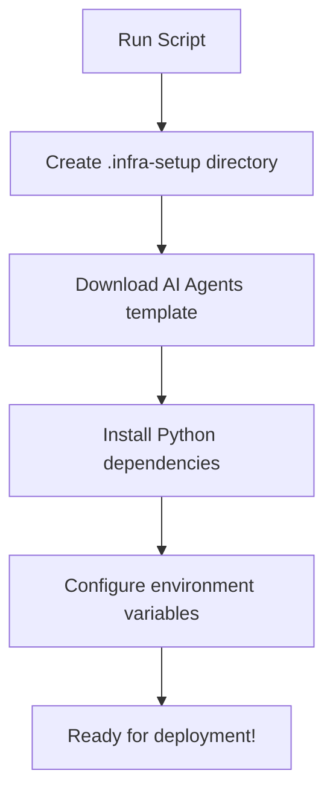

# 01 - Self-Guided Setup

**Duration:** 5 minutes  
**Type:** Self-guided Infrastructure Setup

Welcome to the AI Red Teaming Workshop! We'll use an automated setup approach using the Azure AI Agents template to get you started quickly.

## Overview: What We're Setting Up


*Source: Microsoft Learn - How AI Red Teaming Works*

Our setup will create:
- ✅ **Azure AI Foundry Project** - For cloud-based red teaming
- ✅ **OpenAI Model Deployments** - Target models to test
- ✅ **Storage Account** - For evaluation results
- ✅ **Python Environment** - With PyRIT and dependencies pre-installed

## Step 1: Environment Configuration

First, let's set up your environment variables:

### 1.1 Copy Environment Template

```bash
# Copy the sample environment file
cp .env.sample .env
```

### 1.2 Edit Your Environment File

Open `.env` in your editor and update these key values:

```bash
# Required: Your Azure subscription details
AZURE_SUBSCRIPTION_ID="your-subscription-id-here"
AZURE_RESOURCE_GROUP="your-resource-group-name"
AZURE_LOCATION="swedencentral"

# Will be populated after deployment
AZURE_PROJECT_NAME="will-be-set-by-setup"
AZURE_OPENAI_ENDPOINT="will-be-set-by-setup"
AZURE_OPENAI_KEY="will-be-set-by-setup"
```

> 💡 **Pro Tip**: Use `swedencentral` as your location - it's optimized for AI Red Teaming Agent availability.

## Step 2: Automated Infrastructure Setup

Now let's use our pre-built scripts to set up everything automatically:

### 2.1 Authenticate with Azure

```bash
# Run the authentication script
./scripts/1-setup-auth
```

**What this does:**
- ✅ Logs you into Azure CLI
- ✅ Sets default subscription
- ✅ Validates permissions

### 2.2 Initialize the AI Agents Template

```bash
# Run the template setup script  
./scripts/2-setup-azd
```

**What this script accomplishes:**



**Detailed Actions:**
- 📁 Creates the `.infra-setup` directory
- ⬇️ Initializes the AI agents template from Azure Samples
- 📋 Configures environment variables for the lab
- 🐍 **Installs Python dependencies** automatically:
  - `pip install -r .infra-setup/requirements-dev.txt`
  - `pip install -e .infra-setup/src`
- ⚙️ Sets up infrastructure templates

## Step 3: Deploy Your Infrastructure

Navigate to the setup directory and deploy:

```bash
# Navigate to infrastructure directory
cd .infra-setup

# Deploy everything to Azure
azd up
```

**During deployment, you'll be prompted for:**
- 🌍 **Location**: Choose `swedencentral` (pre-configured for AI Red Teaming)
- 📝 **Environment name**: Use something like `redteam-lab-[yourname]`

**Expected deployment time:** 5-10 minutes ⏱️

## Step 4: Capture Deployment Information

After successful deployment, **azd** will output important information. Update your `.env` file with these values:

```bash
# Navigate back to the workshop root
cd ..

# Edit your .env file with the deployment outputs
```

**Update these values in your `.env` file:**
```bash
# Update with actual deployed values
AZURE_PROJECT_NAME="your-deployed-project-name"
AZURE_OPENAI_ENDPOINT="https://your-deployed-openai.openai.azure.com/"
AZURE_OPENAI_KEY="your-deployed-api-key"
PROJECT_ENDPOINT="https://your-account.services.ai.azure.com/api/projects/your-project"
```

## Step 5: Verify Your Setup

Let's verify everything is working correctly:

### 5.1 Test Python Environment

```bash
# Test that dependencies are installed
python -c "
try:
    import azure.ai.evaluation
    import azure.ai.projects
    print('✅ Azure AI dependencies installed')
except ImportError as e:
    print(f'❌ Missing dependencies: {e}')
"
```

### 5.2 Test Environment Variables

```bash
# Test environment loading
python -c "
import os
from dotenv import load_dotenv
load_dotenv()

required_vars = [
    'AZURE_SUBSCRIPTION_ID',
    'AZURE_OPENAI_ENDPOINT', 
    'AZURE_OPENAI_KEY',
    'PROJECT_ENDPOINT'
]

missing = [var for var in required_vars if not os.getenv(var)]

if not missing:
    print('✅ All required environment variables configured')
else:
    print(f'❌ Missing variables: {missing}')
    print('Please update your .env file')
"
```

### 5.3 Test Azure Authentication

```bash
# Verify Azure login
az account show --query "name" -o tsv
```

## 🎉 Setup Complete!

If all tests pass, your environment is ready for AI red teaming! You now have:

- ✅ **Automated Infrastructure**: Azure AI Foundry project with models deployed
- ✅ **Python Dependencies**: PyRIT and Azure AI Evaluation SDK installed  
- ✅ **Environment Configuration**: All necessary variables configured
- ✅ **Authentication**: Logged into Azure with proper permissions

## What's Next?

In the next lesson, we'll **validate** this template setup and ensure all dependencies are properly installed for both local and cloud red teaming scenarios.

---

**Navigation:** [Module Home](./README.md) | **Next:** [Template Validation](./02-installing-dependencies.md)
  "azure-cli-core": "2.x.x",
  ...
}
```

### Installing Azure CLI (if needed)

#### Windows
```powershell
winget install Microsoft.AzureCLI
```

#### macOS
```bash
brew install azure-cli
```

#### Linux
```bash
curl -sL https://aka.ms/InstallAzureCLIDeb | sudo bash
```

## Step 3: Authenticate with Azure

Login to your Azure account:

```bash
az login
```

This will open a browser window for authentication. Complete the login process.

Verify your subscription:

```bash
az account show
```

**Expected output:**
```json
{
  "environmentName": "AzureCloud",
  "id": "your-subscription-id",
  "name": "Your Subscription Name",
  ...
}
```

## Step 4: Set Azure Subscription (if multiple)

If you have multiple subscriptions, set the one you want to use:

```bash
az account list --output table
az account set --subscription "your-subscription-id"
```

## Step 5: Create Project Directory

Create a dedicated directory for this workshop:

```bash
mkdir ai-red-teaming-workshop
cd ai-red-teaming-workshop
```

## Step 6: Create Python Virtual Environment

Create and activate a virtual environment:

### Windows
```bash
python -m venv venv
venv\Scripts\activate
```

### macOS/Linux
```bash
python -m venv venv
source venv/bin/activate
```

**Verify activation:**
Your command prompt should now show `(venv)` at the beginning.

## Step 7: Set Environment Variables

Create a `.env` file to store your configuration:

```bash
# Create .env file
touch .env
```

Add the following content to `.env` (replace with your actual values):

```bash
# Azure Configuration
AZURE_SUBSCRIPTION_ID="your-subscription-id"
AZURE_RESOURCE_GROUP="your-resource-group"
AZURE_PROJECT_NAME="your-ai-foundry-project"

# Azure OpenAI Configuration (if you have one)
AZURE_OPENAI_ENDPOINT="https://your-openai-resource.openai.azure.com"
AZURE_OPENAI_KEY="your-api-key"
AZURE_OPENAI_DEPLOYMENT="your-deployment-name"
```

> 💡 **Tip**: You can find these values in the Azure portal under your AI Foundry project settings.

## Step 8: Install Python-dotenv

Install python-dotenv to load environment variables:

```bash
pip install python-dotenv
```

## Step 9: Verify Setup

Create a simple test script to verify your setup:

**test_setup.py**
```python
import os
import sys
from dotenv import load_dotenv
from azure.identity import DefaultAzureCredential

# Load environment variables
load_dotenv()

print("=== Environment Setup Verification ===")
print(f"Python version: {sys.version}")
print(f"Python executable: {sys.executable}")

# Check Azure credentials
try:
    credential = DefaultAzureCredential()
    print("✅ Azure authentication: OK")
except Exception as e:
    print(f"❌ Azure authentication failed: {e}")

# Check environment variables
required_vars = [
    "AZURE_SUBSCRIPTION_ID",
    "AZURE_RESOURCE_GROUP", 
    "AZURE_PROJECT_NAME"
]

for var in required_vars:
    value = os.getenv(var)
    if value:
        print(f"✅ {var}: {value[:8]}...")
    else:
        print(f"❌ {var}: Not set")

print("\n=== Setup Complete ===")
```

Run the test:

```bash
python test_setup.py
```

**Expected output:**
```
=== Environment Setup Verification ===
Python version: 3.11.x
Python executable: /path/to/venv/bin/python
✅ Azure authentication: OK
✅ AZURE_SUBSCRIPTION_ID: 12345678...
✅ AZURE_RESOURCE_GROUP: myresour...
✅ AZURE_PROJECT_NAME: myproj...

=== Setup Complete ===
```

## Troubleshooting

### Issue: "python: command not found"
**Solution**: Try `python3` instead of `python`, or check PATH configuration.

### Issue: "az: command not found"
**Solution**: Restart terminal after installing Azure CLI, or check PATH configuration.

### Issue: Azure authentication fails
**Solution**: 
1. Run `az logout` then `az login` again
2. Check if you have the correct permissions
3. Verify your subscription is active

### Issue: Environment variables not loading
**Solution**:
1. Ensure `.env` file is in the same directory as your Python script
2. Check file permissions
3. Verify no extra spaces or quotes in variable assignments

## Security Notes

🔒 **Important Security Reminders:**

1. **Never commit `.env` files** to version control
2. **Use least privilege** Azure permissions
3. **Rotate keys regularly** if using API keys
4. **Monitor resource usage** to avoid unexpected costs

Add `.env` to your `.gitignore`:

```bash
echo ".env" >> .gitignore
```

---

## Checkpoint

Before proceeding, ensure you have:

- ✅ Python 3.10+ installed and verified
- ✅ Azure CLI installed and authenticated
- ✅ Virtual environment created and activated
- ✅ Environment variables configured
- ✅ Test script runs successfully

**Ready?** Let's move on to [Installing Dependencies](./02-installing-dependencies.md)!

---

**Navigation:** [Module Home](./README.md) | **Next:** [Installing Dependencies](./02-installing-dependencies.md)